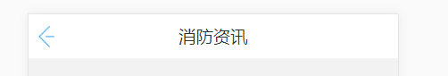

## navHead组件
navHead.vue源码<br/>
```vue
<template>
  <div class="myHeaderBox ui-border-b">
    <div class="bar">
      <div class="gobackIcon" @click="goback()">
      </div>
      
      <div class="goback1">
        <slot name="goback"></slot>
      </div>
      <div class="rightBar">
        <slot name="rightBar"></slot>
      </div>
    </div>
    <div class="title">
      <span>{{navbarOps.title}}</span>
      <slot name="title"></slot>
    </div>
  </div>
</template>
<script>
  export default {
    name: 'navHead',
    props:{
      navbarOps:Object,
    },
    methods:{
      goback(){
        let isTrue = this.navbarOps.goBack;
        if(isTrue){
        	try {
	          	window.webkit.messageHandlers.goBack.postMessage("");
	          } catch (e) {
	            window.android.goBack();
	          }
        }else{
          this.$router.go(-1);
        }
      }
    }
  }
</script>

<!-- Add "scoped" attribute to limit CSS to this component only -->
<style scoped lang="scss">
.ui-border-b:after {
    width: 200%;
    height: 1px;
    bottom: 0px;
    left: 0;
    content: "";
    display: block;
    position: absolute;
    -webkit-transform: scale(0.5);
    -webkit-transform-origin: 0 0;
    -webkit-box-sizing: border-box;
    pointer-events: none;
    border-bottom: 2px solid #E7E7E7;
    /*px*/
    z-index: 1;
}
  .myHeaderBox{
    display: flex;
    width: 100%;
    height: 90px;
    position: fixed;
    top:0;
    left:0;
    z-index: 999;
    overflow: hidden;
    background-color: #ffffff;
    
   }
    .bar{
      position: absolute;
      width: 100%;
      height: 100%;
      display: flex;
     }
      .goback{
        flex: 0 1 4rem;
        display: flex;
        justify-content: center;
        align-items: center;
       }
      .gobackIcon{
        width: 90px;
        height: 90px;
        background: url('../../../assets/img/goback.png') no-repeat 20px center;
        background-size: 36%;
       cursor: pointer;
       } 
      .rightBar{
        flex: 1 1 2rem;
        padding-right: .2rem;
        font-size: 32px;
        box-sizing: border-box;
				color: #38a2f0;
        display: flex;
        align-items: center;
        justify-content: flex-end;
       }
    .title{
      width: 100%;
      height: 100%;
      /*flex: 1 1 2rem;*/
      display: flex;
      color: #333333;
      font-size: 35px;
      align-items: center;
      font-family: 'PingFangSC-Regular';
      justify-content: center;
     }
</style>
```
navHead组件使用 ，在同级index.js文件中,扩展成全局自定义组件<br/>
```js
import navHead from './navhead.vue';

/* istanbul ignore next */
navHead.install = function(Vue) {
  Vue.component(navHead.name, navHead);
};

export default navHead;
```
单文件中具体使用<br/>
```vue
<template>
    <div class="container">
        <nav-head :navbarOps="navbarOps"></nav-head>
    </div>
</template>
<script>	
export default{
	data () {
		return{
			navbarOps: {
				title: '消防资讯',
				goBack: true
			}
		}
	}
}
</script>
```
效果：<br/>
<br/>
## flyButton组件
flyButton.vue源码<br/>
```vue
<template>
	<div class="button-wrapper">
		<div class="button" @click="buttonClick" :style="{ color: activeColor, fontSize: fontSize,backgroundColor: activeBgc,borderColor:borderColor }"><span :class="{'start':startBg,'move':startBg,'end':endBg}" ref="buttonMask"></span>{{title}}</div>
	</div>
</template>

<script>
	export default {
		name:'flyButton',
		props:{
			title:{
				type: String,
				default:'确定'
			},
			activeColor:{
				type: String,
				default:'#333333'
			},
			borderColor:{
				type: String,
				default:'rgba(0,0,0,0)'
			},
			activeBgc:{
				type: String,
				default:'#ffffff'
			},
			fontSize:{
				type: String,
				default:'18px'
			},
		},
		data(){
			return{
				startBg:false,
				endBg:false
			}
		},
		mounted(){
			var that = this;
			this.$refs.buttonMask.addEventListener("touchstart",function(e){
				that.startBg = true;
				that.endBg = false;
		    },false);
		    this.$refs.buttonMask.addEventListener("touchmove",function(e){
		    	that.startBg = true;
				that.endBg = false;
		    },false);
		    this.$refs.buttonMask.addEventListener("touchend",function(e){
		    	that.startBg = false;
				that.endBg = true;
		    },false);
		},
		methods:{
			buttonClick(){
				this.$emit('click');
			}
		}
	}
</script>

<style lang='scss' scoped>
.button-wrapper{
	width: 100%;
}
.button {
    width: 100%;
    height: 80px;
    line-height: 80px;
    text-align: center;
    border:1px solid rgba(0,0,0,0);
    border-radius:10px;
    position: relative;
}
.button>span{
	position: absolute;
	left:0;
	top:0;
	right:0;
	bottom:0;
	width:100%;
	height:100%;
	border-radius:10px;
	transition: all .3 linear;
}
.button>span.start{
	background-color: rgba(0,0,0,.2);
}
.button>span.move{
	background-color: rgba(0,0,0,.2);
}
.button>span.end{
	background-color: rgba(0,0,0,0);
}
</style>
```
flyButton组件使用 ，在同级index.js文件中,扩展成全局自定义组件<br/>
```js
import flyButton from './flyButton.vue';

/* istanbul ignore next */
flyButton.install = function(Vue) {
  Vue.component(flyButton.name, flyButton);
};

export default flyButton;
```
单文件中具体使用<br/>
```vue
<flyButton activeColor="#fff" activeBgc="#38a2f0" title="确定" />
```
## nodata组件
nodata.vue源码<br/>
```vue
<template>
  <div class="nodataBox">
    <div v-show="showNoData" class="noData">
      <div><!--nodata图标--></div>
      <p>{{tips}}</p>
    </div>
  </div>
</template>
<script>
  export default {
    name: 'nodata',
    components: {},
    props:{
      tips: String,
      showNoData: Boolean,
    },
    data() {
        return {}
    },
    created() {

    },
    mounted() {

    },
    computed: {},
    methods: {}
  }
</script>

<!-- Add "scoped" attribute to limit CSS to this component only -->
<style scoped lang="scss">
    .noData{
    	padding:2rem 0;
      position: relative;
      div{
        width: 390px;
        height: 280px;
        margin: 0 auto;
        background: url('../../../assets/img/nodata.png') no-repeat center center;
        background-size: contain;
       }
      p{
      	margin-top: 20px;
        color:#aaaaaa;
        font-size: 28px;
        text-align: center;
        display: block;
        width: 100%;
        }
      }
      
        
</style>

```
nodata组件使用 ，在同级index.js文件中,扩展成全局自定义组件<br/>
```js
import nodata from './nodata.vue';

/* istanbul ignore next */
nodata.install = function(Vue) {
  Vue.component(nodata.name, nodata);
};

export default nodata;
```
单文件中具体使用<br/>
```vue
<template>
    <div class="container">
        <nodata :showNoData="data.length==0" :tips="nodatatips"></nodata>
    </div>
</template>
<script>    
export default{
    data () {
        return{
        	data：[],
            nodatatips:'暂无数据'
        }
    }
}
</script>

```
## toast组件
>用途：消息提示框

toast.vue源码<br/>
```vue
<template>
    <transition name='fade'>
    <div v-show='visible' :class='position' class='toast'>
         <span>{{message}}</span>
    </div>
    </transition>
</template>

<script>
    import pageChange from '../../mixins/index'
	export default {
		mixins: [pageChange],
        data() {
            return {
                visible: false,
                message : '',
                position : ''
            };
        }
    }
</script>


<style scoped lang="scss">
.toast {
    position: fixed;
    left:50%;
    transform:translate(-50%,-50%) scale(1);
    word-wrap:break-word;
    padding:16px 40px;
    text-align: center;
    z-index:9999;
    font-size:26px;
    max-width:80%;
    color: #fff;
    font-size:"微软雅黑";
    border-radius: 10px;
    background: rgba(0,0,0,0.8);
    overflow: hidden;
}
.toast.middle{
    top:50%;
}
.toast.top{
    top:10%;
}
.toast.bottom{
    top:90%;
}
.toast.leave{
    top:200%;
}
.fade-enter-active, .fade-leave-active {
  transition: transform .5s;
}
.fade-enter, .fade-leave-active {
	transform:translate(-50%,-50%) scale(0);
}
</style>
```
toast组件使用 ，在同级tost.js文件中,扩展成全局自定义组件<br/>
```js
import Vue from 'vue'
import ToastVue from './toast.vue'
const ToastConstructor = Vue.extend(ToastVue)
let removeDom = event => {
    event.target.parentNode.removeChild(event.target);

};
ToastConstructor.prototype.close = function() {
    this.visible = false;
    this.$el.addEventListener('transitionend', removeDom);
};
const Toast = (options = {}) => {

    var instance = new ToastConstructor().$mount(document.createElement('div'))
    let duration = options.duration || 2500;
    instance.message = typeof options === 'string' ? options : options.message
    instance.position = options.position || 'leave'
    document.body.appendChild(instance.$el);
    instance.visible = true;
    Vue.nextTick(() => {
        instance.timer = setTimeout(function() {
            instance.close();
        }, duration);
    })
    return instance
}


export default Toast
```
src/components/index.js中进行二次封装
```js
import Toast from './toast/toast'
/*公共弹框*/
var $toast;
export const toast = (msg, pos, time) => {
	$toast = Toast({
		message: msg,
		position: pos ? pos : 'middle',
		duration: time ? time : 2000
	})
	return $toast;
}
export const hidetoast = () => {
	return $toast.close();
}
```
可全局使用的自定义组件
```js
import {
	toast,
} from '../../components/index.js'
export default {
	version: '0.0.1',
	install: function(Vue) {
		Vue.prototype.$toast = toast;
		Vue.prototype.$hidetoast = hidetoast;
	},
}
```

## loading插件（依赖jquery）
>用途：请求加载等待框

src/components/plungs/loading.js源码<br/>
```js
// 加载等待弹框,依赖jquery
function create_message_info(flag) {
	 if (flag) {
    if ($('.loading_shade').length == 0) {
      let body = $("body");
      //创建遮罩层
      let shade_div = $("<div class='loading_shade'></div>").appendTo(body);
      let screenWidth = $(window).width();
      let screenHeight = $(window).height();
      shade_div.css({
        position: "fixed",
        top: 0,
        left: 0,
        right:0,
        bottom:0,
        width: screenWidth,
        height: screenHeight,
        backgroundColor: 'rgba(0,0,0,0.4)',
        zIndex: "8888888",
        display: 'flex',
        alignItems: 'center',
        justifyContent: 'center'
      });

      let animation_div = $('<div class="animation-div"></div>').appendTo(shade_div);
      let item1 = $('<div class="animation-item animation-item1"></div>').appendTo(animation_div);
      let item2 = $('<div class="animation-item animation-item2"></div>').appendTo(animation_div);
      let item3 = $('<div class="animation-item animation-item3"></div>').appendTo(animation_div);
      let item4 = $('<div class="animation-item animation-item4"></div>').appendTo(animation_div);
      let item5 = $('<div class="animation-item animation-item5"></div>').appendTo(animation_div);
      let text = $('<div>努力加载中...</div>').appendTo(animation_div);

      let point_left = 0.8;
      let point_right = 1.4;
      let point_top = 0.5;
      let point_bottom = 1.1;
      let point_yundong = {
        'left': point_left,
        'top': point_top
      }

      animation_div.css({
        boxSizing: "border-box",
        width: "2.6rem",
        height: "2.6rem",
        backgroundColor: "white",
        textAlign: 'center',
        position: 'relative',
        borderRadius: '10%',
      });
      $('.animation-item').css({
        width: '0.4rem',
        height: '0.4rem',
        borderRadius: '100%',
        backgroundColor: '#3ba2ed',
        position: 'absolute',
      })
      item1.css({
        left: point_left + 'rem',
        top: point_top + 'rem',
      })
      item2.css({
        left: point_right + 'rem',
        top: point_top + 'rem',
      })
      item3.css({
        left: point_right + 'rem',
        top: point_bottom + 'rem',
      })
      item4.css({
        left: point_left + 'rem',
        top: point_bottom + 'rem',
      })
      item5.css({
        left: point_yundong.left + 'rem',
        top: point_yundong.top + 'rem',
      })
      text.css({
        width: '100%',
        fontSize: '0.36rem',
        position: 'absolute',
        bottom: '0.3rem',
        textAlign: 'center',
      })

      let status = 0;
      let show_flag = 0;
      let aa = 0;
      let set_time = window.setInterval(function () {
        if ($('.loading_shade').length > 0) {
          let move_right = function () {
            if (!show_flag) {
              item1.css({
                opacity: 0,
              })
            } else {
              item1.css({
                opacity: 1,
              })
            }
            point_yundong.left = point_yundong.left + 0.1;
            item5_set();
            if (point_yundong.left >= point_right) {
              point_yundong.left = point_right;
              status = 1;
            }
          }
          let move_down = function () {
            if (!show_flag) {
              item2.css({
                opacity: 0,
              })
            } else {
              item2.css({
                opacity: 1,
              })
            }
            point_yundong.top = point_yundong.top + 0.1;
            item5_set();
            if (point_yundong.top >= point_bottom) {
              point_yundong.top = point_bottom;
              status = 2;
            }

          }
          let move_left = function () {
            if (!show_flag) {
              item3.css({
                opacity: 0,
              })
            } else {
              item3.css({
                opacity: 1,
              })
            }
            point_yundong.left = point_yundong.left - 0.1;
            item5_set();
            if (point_yundong.left <= point_left) {
              point_yundong.left = point_left;
              status = 3;
            }
          }
          let move_up = function () {
            if (!show_flag) {
              item4.css({
                opacity: 0,
              })
            } else {
              item4.css({
                opacity: 1,
              })
            }
            point_yundong.top = point_yundong.top - 0.1;
            item5_set();
            if (point_yundong.top <= point_top) {
              point_yundong.top = point_top;
              status = 0;
              show_flag = !show_flag;
            }
          }
          let item5_set = function () {
            item5.css({
              left: point_yundong.left + 'rem',
              top: point_yundong.top + 'rem',
            })
          }
          switch (status) {
            case 0:
              move_right();
              break;
            case 1:
              move_down();
              break;
            case 2:
              move_left();
              break;
            case 3:
              move_up();
              break;
          }
        }
      }, 50);
      $('<div class="animation-settimeout" style="display: none">' + set_time + '</div>').appendTo(shade_div);
    }
    else{
      window.clearInterval(parseInt($('.animation-settimeout').html()));
      $(".loading_shade").remove();
    }
  } else {
    window.clearInterval(parseInt($('.animation-settimeout').html()));
    $(".loading_shade").remove();
  }
}
export const loading = (falg) => {
  create_message_info(falg);
};

```
loading插件使用 ，可扩展成全局自定义组件，也可在单文件中使用，单文件使用示例<br/>
```js
import loading from '../../components/plungs/loading.js'

loading(true)	//显示加载框
loading(false)	//关闭加载框
```

